# Software Requirements Specification (SRS)
## PersonaFlow — Dynamic AI Conversation Agent Platform

**Version:** 1.0  
**Date:** 2026-03-10  
**Standard:** IEEE 830-1998  
**Status:** Draft  

---

## Table of Contents

1. [Introduction](#1-introduction)
2. [Overall Description](#2-overall-description)
3. [Functional Requirements](#3-functional-requirements)
4. [Non-Functional Requirements](#4-non-functional-requirements)
5. [System Architecture](#5-system-architecture)
6. [Use Case Diagrams](#6-use-case-diagrams)
7. [Data Flow Diagrams (DFD)](#7-data-flow-diagrams-dfd)
8. [Activity Diagrams](#8-activity-diagrams)
9. [Sequence Diagrams](#9-sequence-diagrams)
10. [Entity-Relationship Diagram](#10-entity-relationship-diagram)
11. [State Diagrams](#11-state-diagrams)
12. [Class Diagram](#12-class-diagram)
13. [API Specification](#13-api-specification)
14. [UI/UX Requirements](#14-uiux-requirements)
15. [External Interface Requirements](#15-external-interface-requirements)
16. [Constraints & Limitations](#16-constraints--limitations)
17. [Future Enhancements](#17-future-enhancements)
18. [Appendix](#18-appendix)

---

## 1. Introduction

### 1.1 Purpose
This Software Requirements Specification (SRS) defines the complete functional and non-functional requirements for **PersonaFlow**, a full-stack web application enabling users to create, manage, and interact with custom AI-powered conversation agents. This document is intended for developers, testers, and stakeholders.

### 1.2 Scope
PersonaFlow provides:
- Custom AI agent creation and management
- Text chat and 3D avatar video call interactions
- Public agent sharing via tokenized URLs
- Automated performance reporting and scoring
- AI-powered analytics chat over report data
- Teleprompter-style Anchoring mode for public speaking practice

### 1.3 Definitions & Acronyms

| Term | Definition |
|------|-----------|
| SPA | Single Page Application |
| LLM | Large Language Model |
| TTS | Text-to-Speech |
| STT | Speech-to-Text |
| SRS | Software Requirements Specification |
| GLTF | GL Transmission Format (3D model format) |
| FBX | Filmbox (3D model format) |
| FR | Functional Requirement |
| NFR | Non-Functional Requirement |
| API | Application Programming Interface |
| JWT | JSON Web Token |
| CRUD | Create, Read, Update, Delete |
| DFD | Data Flow Diagram |

### 1.4 References
- IEEE Std 830-1998: IEEE Recommended Practice for Software Requirements Specifications
- Flask 3.0 Documentation
- Ollama REST API Documentation
- Three.js Documentation
- Microsoft Edge TTS Documentation
- OpenAI Whisper Documentation

### 1.5 Overview
This document is structured into: overall system description, detailed functional requirements per module, non-functional requirements, and Mermaid-based UML/DFD diagrams covering all major system interactions and flows.

---

## 2. Overall Description

### 2.1 Product Perspective
PersonaFlow is a standalone web application deployed locally. It consists of:
- A **Flask** REST API backend (port 5000)
- A **Vanilla JavaScript SPA** frontend served by Flask
- A **SQLite** database for persistence
- An **Ollama** local LLM server (port 11434) for all AI inference

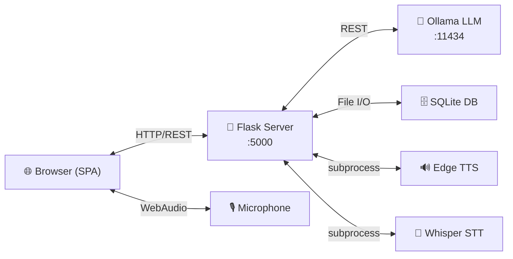
```mermaid
graph LR
    Browser["🌐 Browser (SPA)"] <-->|HTTP/REST| Flask["🐍 Flask Server\n:5000"]
    Flask <-->|REST| Ollama["🤖 Ollama LLM\n:11434"]
    Flask <-->|File I/O| SQLite["🗄️ SQLite DB"]
    Flask <-->|subprocess| EdgeTTS["🔊 Edge TTS"]
    Flask <-->|subprocess| Whisper["🎤 Whisper STT"]
    Browser <-->|WebAudio| Mic["🎙️ Microphone"]
```

### 2.2 Product Functions Summary

| Module | Core Function |
|--------|--------------|
| Authentication | User registration, login, session management |
| Agent Management | Create/edit/delete AI agents with full personality config |
| Text Chat | Real-time AI conversation in text mode |
| Video Call | 3D avatar AI conversation with TTS/STT/lip-sync |
| Share Links | Tokenized public agent sharing with access controls |
| Reports | Auto-generated evaluation reports per conversation |
| Report Chat | AI analytics over historical report data |
| Anchoring | Teleprompter script reader with TTS and remote control |
| Dashboard | Aggregated stats and recent activity |

### 2.3 User Classes

| User Class | Description | Access Level |
|------------|-------------|--------------|
| Registered User | Created account, can manage agents and conversations | Full access to own data |
| Guest (Share Link User) | Accesses agent via public token URL | Chat only, no auth required |
| Agent Owner | Registered user who created a specific agent | Full control of that agent |

### 2.4 Operating Environment
- **Server OS:** Windows / Linux / macOS
- **Python:** 3.10+
- **Browser:** Chrome/Edge (recommended for Web Speech API support)
- **Ollama:** Must be running locally at `localhost:11434`
- **Deployment:** Currently localhost only (`http://localhost:5000`)

### 2.5 Design Constraints
- All AI inference must remain local (Ollama); no external AI API calls
- SQLite database (single file, not suitable for concurrent multi-user production)
- Browser must support WebAudio API for video call features
- Three.js avatar requires WebGL-capable browser

### 2.6 Assumptions & Dependencies
- Ollama is installed and running with the `jarvis-x` model loaded
- Python 3.10+ with all `requirements.txt` packages installed
- User browser supports: ES6 modules, WebAudio API, WebGL, Web Speech API
- `edge-tts` CLI is available on the system PATH

---

## 3. Functional Requirements

### 3.1 Authentication (FR-AUTH)

| ID | Requirement |
|----|-------------|
| FR-AUTH-01 | The system shall allow new users to register with name, email, and password |
| FR-AUTH-02 | Passwords shall be stored as bcrypt hashes; plain text passwords shall never be persisted |
| FR-AUTH-03 | The system shall authenticate users via email/password and create a server-side session |
| FR-AUTH-04 | Sessions shall expire after 24 hours of inactivity |
| FR-AUTH-05 | The system shall expose `GET /api/auth/me` to return the current authenticated user's info |
| FR-AUTH-06 | All non-public API routes shall be protected with `@login_required` decorator |
| FR-AUTH-07 | The frontend SPA shall redirect unauthenticated users to `#/login` |
| FR-AUTH-08 | The system shall allow users to log out, destroying the server-side session |
| FR-AUTH-09 | Each user shall have an `avatar_color` field auto-assigned on registration |

### 3.2 Agent Management (FR-AGENT)

| ID | Requirement |
|----|-------------|
| FR-AGENT-01 | The system shall allow users to create AI agents with: name, role, goal, opening message, task description, rules (JSON array), tone, knowledge base text |
| FR-AGENT-02 | The system shall support a 4-step creation wizard UI for guided agent setup |
| FR-AGENT-03 | Each agent shall have an `output_config` JSON field containing at minimum an `evaluation` boolean flag |
| FR-AGENT-04 | Each agent shall have a visual icon and color for identification |
| FR-AGENT-05 | The system shall support two agent types: `conversation` and `anchoring` |
| FR-AGENT-06 | Users shall be able to list, view, update, and delete their own agents |
| FR-AGENT-07 | The system shall provide a template gallery with pre-built agent configurations |
| FR-AGENT-08 | Agent detail page shall display tabs: Overview, Conversations, Reports, Share, Anchoring, Report Chat |
| FR-AGENT-09 | The system shall support a default agent flag (`is_default`) per user |
| FR-AGENT-10 | Agent rules shall be stored as a JSON array and rendered as an editable list |

### 3.3 Text Chat (FR-CHAT)

| ID | Requirement |
|----|-------------|
| FR-CHAT-01 | The system shall create a `Conversation` record when a chat session begins |
| FR-CHAT-02 | Each user message shall be persisted as a `Message` record with role `user` |
| FR-CHAT-03 | The system shall call the Ollama LLM with agent personality context + full conversation history to generate responses |
| FR-CHAT-04 | Agent responses shall be persisted as `Message` records with role `agent` |
| FR-CHAT-05 | Chat UI shall display messages in chronological order with timestamps |
| FR-CHAT-06 | The system shall allow users to end a conversation, triggering report generation if evaluation is enabled |
| FR-CHAT-07 | Ending a conversation shall set its status to `completed` and record `ended_at` |

### 3.4 Video Call — 3D Avatar (FR-VIDEO)

| ID | Requirement |
|----|-------------|
| FR-VIDEO-01 | The system shall render a 3D avatar using Three.js from a GLTF/FBX model |
| FR-VIDEO-02 | The system shall convert agent text responses to audio using Edge TTS |
| FR-VIDEO-03 | The system shall convert user speech to text using Whisper STT |
| FR-VIDEO-04 | The microphone shall remain active at all times (always-on) with browser echo cancellation enabled |
| FR-VIDEO-05 | If the agent is speaking and the user speaks, the system shall interrupt TTS playback and process user input |
| FR-VIDEO-06 | The avatar shall animate lip movements using a phoneme-based lip-sync engine (`lipsync-engine.js`) |
| FR-VIDEO-07 | The avatar shall play idle animations when not speaking |
| FR-VIDEO-08 | Video call mode shall be set as `video` in the Conversation record |

### 3.5 Public Share Links (FR-SHARE)

| ID | Requirement |
|----|-------------|
| FR-SHARE-01 | Agent owners shall be able to generate tokenized share URLs for any of their agents |
| FR-SHARE-02 | Share links shall support optional password protection |
| FR-SHARE-03 | Share links shall support optional expiry date/time |
| FR-SHARE-04 | Share links shall support a maximum usage count (`max_uses`) |
| FR-SHARE-05 | Share links shall optionally require participant name and/or email before chat begins |
| FR-SHARE-06 | Public users (guests) shall access shared agents without creating an account |
| FR-SHARE-07 | Each use of a share link shall increment `current_uses`; once `max_uses` is reached, the link shall be disabled |
| FR-SHARE-08 | The system shall record participant name/email on the `Conversation` record |

### 3.6 Performance Reports (FR-REPORT)

| ID | Requirement |
|----|-------------|
| FR-REPORT-01 | The system shall auto-generate a report when a conversation ends if `output_config.evaluation` is `true` |
| FR-REPORT-02 | Reports shall include: overall score (0–100), per-criteria scores (JSON), summary, feedback, and recommendations |
| FR-REPORT-03 | Reports shall include the full conversation transcript as a JSON array |
| FR-REPORT-04 | Reports shall be manually triggerable via `POST /api/reports/generate/<conv_id>` |
| FR-REPORT-05 | Users shall be able to export any report as a DOCX file |
| FR-REPORT-06 | The Reports page shall display all reports as a history card list |

### 3.7 Report Chat — AI Analytics (FR-RCHAT)

| ID | Requirement |
|----|-------------|
| FR-RCHAT-01 | Each agent detail page shall include a Report Chat tab with an AI chatbot |
| FR-RCHAT-02 | The LLM context shall include all of the agent's past conversations and associated reports |
| FR-RCHAT-03 | Users shall be able to ask analytical questions (e.g., "What topics does this user struggle with?") |
| FR-RCHAT-04 | Report chat shall be agent-specific (isolated per agent, not global) |

### 3.8 Anchoring Mode (FR-ANCHOR)

| ID | Requirement |
|----|-------------|
| FR-ANCHOR-01 | The system shall support a special `anchoring` agent type with a `script_content` field |
| FR-ANCHOR-02 | The anchoring local view shall display the script as a teleprompter, advancing line by line |
| FR-ANCHOR-03 | The system shall read each script line via TTS using Edge TTS |
| FR-ANCHOR-04 | A remote control view shall allow pause, resume, and stop of an anchoring session |
| FR-ANCHOR-05 | Anchoring session state (current line, paused/running/stopped) shall be stored in-memory per `agent_id` |
| FR-ANCHOR-06 | Remote view shall poll `GET /api/anchoring/<agent_id>/status` to display current state |

### 3.9 Dashboard (FR-DASH)

| ID | Requirement |
|----|-------------|
| FR-DASH-01 | Dashboard shall display total agent count, total conversation count, and total report count for the user |
| FR-DASH-02 | Dashboard shall list the most recent conversations with agent name, date, and status |

### 3.10 Notifications & UI System (FR-UI)

| ID | Requirement |
|----|-------------|
| FR-UI-01 | The system shall display toast notifications for success and error events |
| FR-UI-02 | The system shall display a notification panel as a fixed overlay above the sidebar |
| FR-UI-03 | Dark mode shall be toggled via a UI control, persisted in `localStorage` as `personaflow-theme` |
| FR-UI-04 | Dark mode shall be applied via `[data-theme=dark]` attribute on `<html>` using a blocking script before body render to prevent flash |
| FR-UI-05 | A first-time onboarding flow shall guide new users through the platform features |

---

## 4. Non-Functional Requirements

### 4.1 Performance (NFR-PERF)

| ID | Requirement |
|----|-------------|
| NFR-PERF-01 | Text chat responses shall appear within 5 seconds under normal Ollama load |
| NFR-PERF-02 | TTS audio generation shall complete within 3 seconds for responses under 100 words |
| NFR-PERF-03 | Page navigation within the SPA shall complete in under 200ms (no network round-trip) |
| NFR-PERF-04 | 3D avatar shall render at a minimum of 30 FPS on WebGL-capable hardware |

### 4.2 Security (NFR-SEC)

| ID | Requirement |
|----|-------------|
| NFR-SEC-01 | All passwords shall be hashed with bcrypt before storage |
| NFR-SEC-02 | Session tokens shall be HTTP-only cookies managed by Flask |
| NFR-SEC-03 | Share link tokens shall be cryptographically random (UUID or similar) |
| NFR-SEC-04 | All authenticated API routes shall validate session on every request |
| NFR-SEC-05 | Users shall only be able to access their own agents, conversations, and reports |

### 4.3 Usability (NFR-USE)

| ID | Requirement |
|----|-------------|
| NFR-USE-01 | The UI shall support both light and dark mode without any flash on load |
| NFR-USE-02 | All important actions shall provide immediate feedback via toast notifications |
| NFR-USE-03 | The agent creation wizard shall be completable in under 5 minutes for a new user |
| NFR-USE-04 | The application shall be fully navigable via the sidebar without page reloads |

### 4.4 Reliability (NFR-REL)

| ID | Requirement |
|----|-------------|
| NFR-REL-01 | If Ollama is unavailable, the system shall return a user-friendly error without crashing |
| NFR-REL-02 | Database transactions shall be atomic; partial failures shall be rolled back |
| NFR-REL-03 | If TTS fails during video call, the system shall fall back to text-only display |

### 4.5 Maintainability (NFR-MAINT)

| ID | Requirement |
|----|-------------|
| NFR-MAINT-01 | All backend routes shall be contained in `app.py` with logical grouping by feature |
| NFR-MAINT-02 | AI interaction logic shall be isolated in `ai_service.py` |
| NFR-MAINT-03 | Frontend pages shall be separate JS modules in `frontend/js/pages/` |
| NFR-MAINT-04 | A single `api.js` module shall centralize all frontend HTTP calls |

---

## 5. System Architecture

### 5.1 High-Level Component Architecture

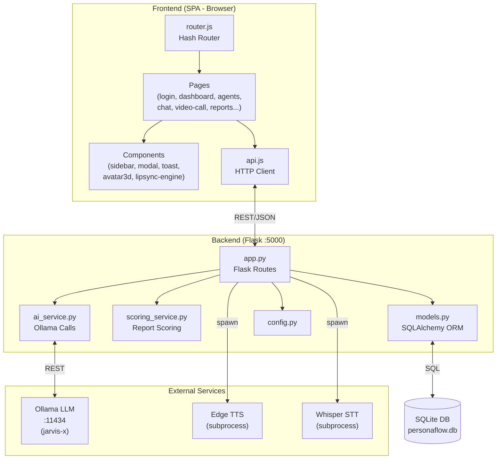
```mermaid
graph TB
    subgraph Frontend["Frontend (SPA - Browser)"]
        Router["router.js\nHash Router"]
        Pages["Pages\n(login, dashboard, agents,\nchat, video-call, reports...)"]
        Components["Components\n(sidebar, modal, toast,\navatar3d, lipsync-engine)"]
        API_JS["api.js\nHTTP Client"]
        Router --> Pages
        Pages --> Components
        Pages --> API_JS
    end

    subgraph Backend["Backend (Flask :5000)"]
        AppPy["app.py\nFlask Routes"]
        AI["ai_service.py\nOllama Calls"]
        Scoring["scoring_service.py\nReport Scoring"]
        Models["models.py\nSQLAlchemy ORM"]
        Config["config.py"]
        AppPy --> AI
        AppPy --> Scoring
        AppPy --> Models
        AppPy --> Config
    end

    subgraph ExternalServices["External Services"]
        Ollama["Ollama LLM\n:11434\n(jarvis-x)"]
        EdgeTTS["Edge TTS\n(subprocess)"]
        Whisper["Whisper STT\n(subprocess)"]
    end

    DB[("SQLite DB\npersonaflow.db")]

    API_JS <-->|REST/JSON| AppPy
    AI <-->|REST| Ollama
    AppPy -->|spawn| EdgeTTS
    AppPy -->|spawn| Whisper
    Models <-->|SQL| DB
```

---

## 6. Use Case Diagrams

### 6.1 Overall System Use Cases

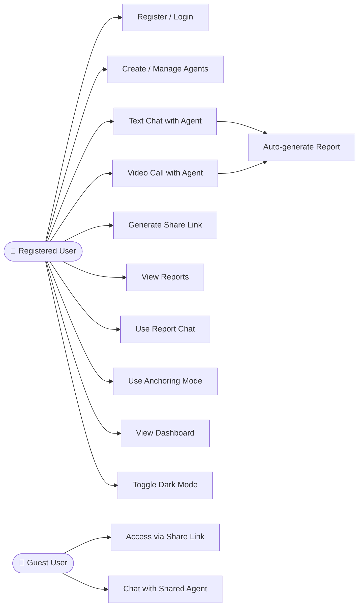
```mermaid
graph LR
    RU(["👤 Registered User"])
    GU(["👥 Guest User"])

    RU --> UC1["Register / Login"]
    RU --> UC2["Create / Manage Agents"]
    RU --> UC3["Text Chat with Agent"]
    RU --> UC4["Video Call with Agent"]
    RU --> UC5["Generate Share Link"]
    RU --> UC6["View Reports"]
    RU --> UC7["Use Report Chat"]
    RU --> UC8["Use Anchoring Mode"]
    RU --> UC9["View Dashboard"]
    RU --> UC10["Toggle Dark Mode"]

    GU --> UC11["Access via Share Link"]
    GU --> UC12["Chat with Shared Agent"]

    UC3 --> UC13["Auto-generate Report"]
    UC4 --> UC13
```

### 6.2 Agent Management Use Case

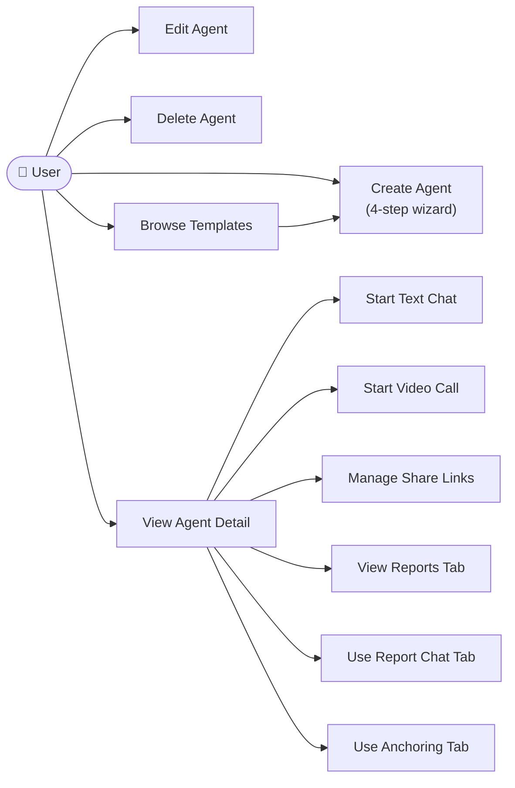
```mermaid
graph LR
    U(["👤 User"])
    U --> A["Create Agent\n(4-step wizard)"]
    U --> B["Edit Agent"]
    U --> C["Delete Agent"]
    U --> D["View Agent Detail"]
    U --> E["Browse Templates"]
    E --> A
    D --> F["Start Text Chat"]
    D --> G["Start Video Call"]
    D --> H["Manage Share Links"]
    D --> I["View Reports Tab"]
    D --> J["Use Report Chat Tab"]
    D --> K["Use Anchoring Tab"]
```

---

## 7. Data Flow Diagrams (DFD)

### 7.1 Level 0 — Context Diagram

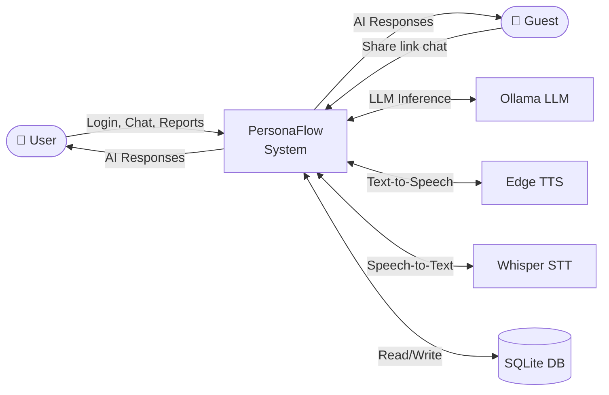
```mermaid
graph LR
    User(["👤 User"]) -->|"Login, Chat, Reports"| PF["PersonaFlow\nSystem"]
    Guest(["👥 Guest"]) -->|"Share link chat"| PF
    PF -->|"AI Responses"| User
    PF -->|"AI Responses"| Guest
    PF <-->|"LLM Inference"| Ollama["Ollama LLM"]
    PF <-->|"Text-to-Speech"| TTS["Edge TTS"]
    PF <-->|"Speech-to-Text"| STT["Whisper STT"]
    PF <-->|"Read/Write"| DB[("SQLite DB")]
```

### 7.2 Level 1 — Main Data Flows

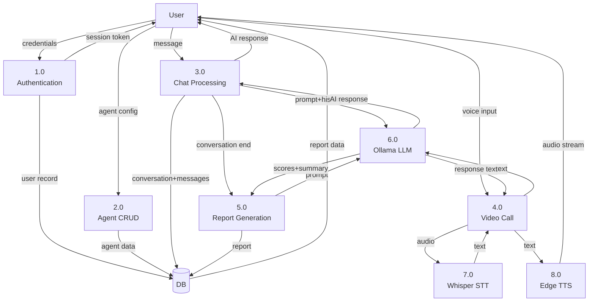
```mermaid
flowchart TD
    U["User"] -->|credentials| P1["1.0\nAuthentication"]
    P1 -->|session token| U
    P1 -->|user record| DB[("DB")]

    U -->|agent config| P2["2.0\nAgent CRUD"]
    P2 -->|agent data| DB

    U -->|message| P3["3.0\nChat Processing"]
    P3 -->|conversation+messages| DB
    P3 -->|prompt+history| P6["6.0\nOllama LLM"]
    P6 -->|AI response| P3
    P3 -->|AI response| U

    U -->|voice input| P4["4.0\nVideo Call"]
    P4 -->|audio| P7["7.0\nWhisper STT"]
    P7 -->|text| P4
    P4 -->|text| P6
    P6 -->|response text| P4
    P4 -->|text| P8["8.0\nEdge TTS"]
    P8 -->|audio stream| U

    P3 -->|conversation end| P5["5.0\nReport Generation"]
    P5 -->|prompt| P6
    P6 -->|scores+summary| P5
    P5 -->|report| DB
    DB -->|report data| U
```

### 7.3 Level 2 — Chat Processing Detail

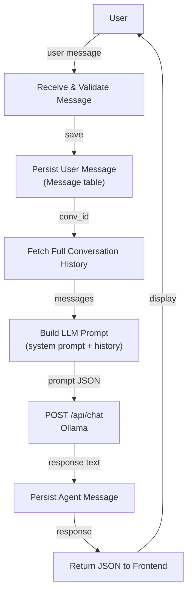
```mermaid
flowchart TD
    U["User"] -->|user message| A["Receive & Validate Message"]
    A -->|save| B["Persist User Message\n(Message table)"]
    B -->|conv_id| C["Fetch Full Conversation History"]
    C -->|messages| D["Build LLM Prompt\n(system prompt + history)"]
    D -->|prompt JSON| E["POST /api/chat\nOllama"]
    E -->|response text| F["Persist Agent Message"]
    F -->|response| G["Return JSON to Frontend"]
    G -->|display| U
```

---

## 8. Activity Diagrams

### 8.1 User Registration & Login Flow

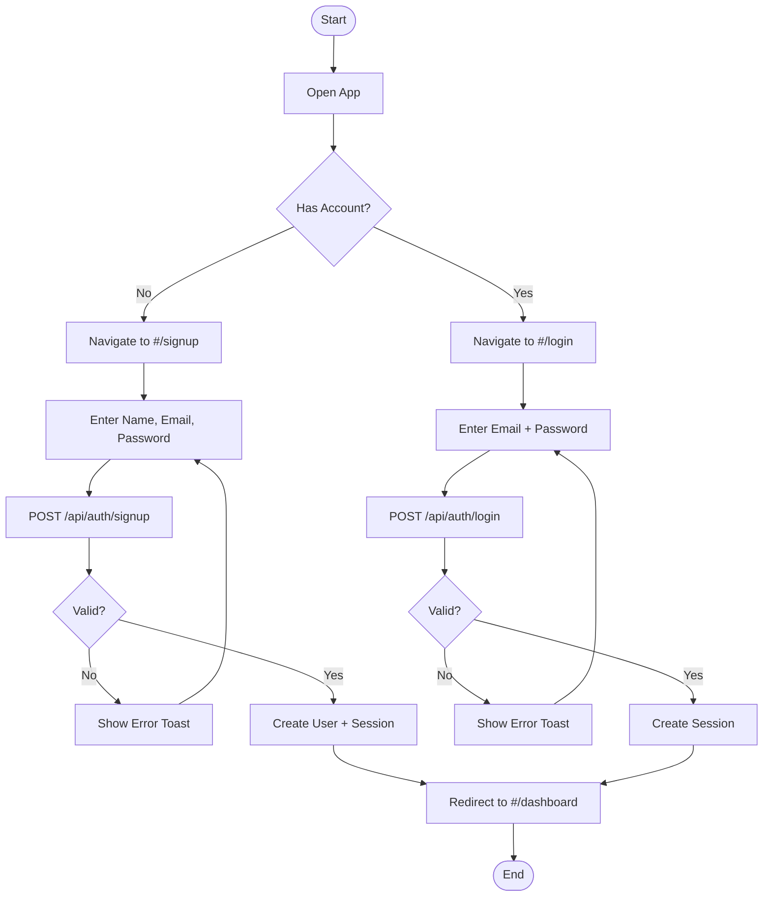
```mermaid
flowchart TD
    Start([Start]) --> A["Open App"]
    A --> B{"Has Account?"}
    B -->|No| C["Navigate to #/signup"]
    C --> D["Enter Name, Email, Password"]
    D --> E["POST /api/auth/signup"]
    E --> F{"Valid?"}
    F -->|No| G["Show Error Toast"] --> D
    F -->|Yes| H["Create User + Session"]
    H --> I["Redirect to #/dashboard"]
    B -->|Yes| J["Navigate to #/login"]
    J --> K["Enter Email + Password"]
    K --> L["POST /api/auth/login"]
    L --> M{"Valid?"}
    M -->|No| N["Show Error Toast"] --> K
    M -->|Yes| O["Create Session"]
    O --> I
    I --> End([End])
```

### 8.2 Agent Creation Wizard Activity

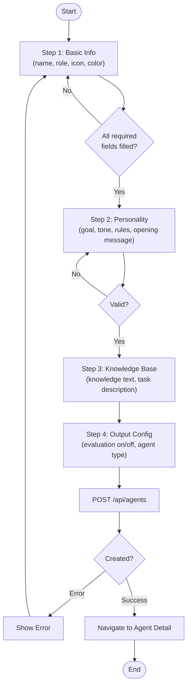
```mermaid
flowchart TD
    Start([Start]) --> S1["Step 1: Basic Info\n(name, role, icon, color)"]
    S1 --> V1{"All required\nfields filled?"}
    V1 -->|No| S1
    V1 -->|Yes| S2["Step 2: Personality\n(goal, tone, rules, opening message)"]
    S2 --> V2{"Valid?"}
    V2 -->|No| S2
    V2 -->|Yes| S3["Step 3: Knowledge Base\n(knowledge text, task description)"]
    S3 --> S4["Step 4: Output Config\n(evaluation on/off, agent type)"]
    S4 --> Post["POST /api/agents"]
    Post --> R{"Created?"}
    R -->|Error| Err["Show Error"] --> S1
    R -->|Success| Nav["Navigate to Agent Detail"]
    Nav --> End([End])
```

### 8.3 Video Call Flow Activity

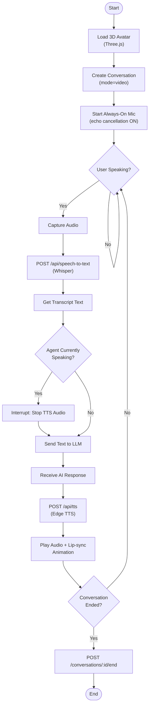
```mermaid
flowchart TD
    Start([Start]) --> A["Load 3D Avatar\n(Three.js)"]
    A --> B["Create Conversation\n(mode=video)"]
    B --> C["Start Always-On Mic\n(echo cancellation ON)"]
    C --> D{"User Speaking?"}
    D -->|No| D
    D -->|Yes| E["Capture Audio"]
    E --> F["POST /api/speech-to-text\n(Whisper)"]
    F --> G["Get Transcript Text"]
    G --> H{"Agent Currently\nSpeaking?"}
    H -->|Yes| I["Interrupt: Stop TTS Audio"]
    I --> J["Send Text to LLM"]
    H -->|No| J
    J --> K["Receive AI Response"]
    K --> L["POST /api/tts\n(Edge TTS)"]
    L --> M["Play Audio + Lip-sync\nAnimation"]
    M --> N{"Conversation\nEnded?"}
    N -->|No| D
    N -->|Yes| O["POST /conversations/:id/end"]
    O --> End([End])
```

### 8.4 Report Generation Activity

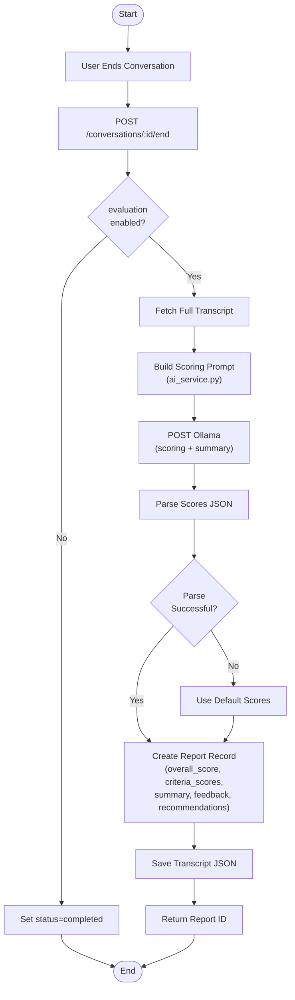
```mermaid
flowchart TD
    Start([Start]) --> A["User Ends Conversation"]
    A --> B["POST /conversations/:id/end"]
    B --> C{"evaluation\nenabled?"}
    C -->|No| D["Set status=completed"] --> End([End])
    C -->|Yes| E["Fetch Full Transcript"]
    E --> F["Build Scoring Prompt\n(ai_service.py)"]
    F --> G["POST Ollama\n(scoring + summary)"]
    G --> H["Parse Scores JSON"]
    H --> I{"Parse\nSuccessful?"}
    I -->|No| J["Use Default Scores"]
    I -->|Yes| K["Create Report Record\n(overall_score, criteria_scores,\nsummary, feedback, recommendations)"]
    J --> K
    K --> L["Save Transcript JSON"]
    L --> M["Return Report ID"]
    M --> End
```

### 8.5 Anchoring Session Activity

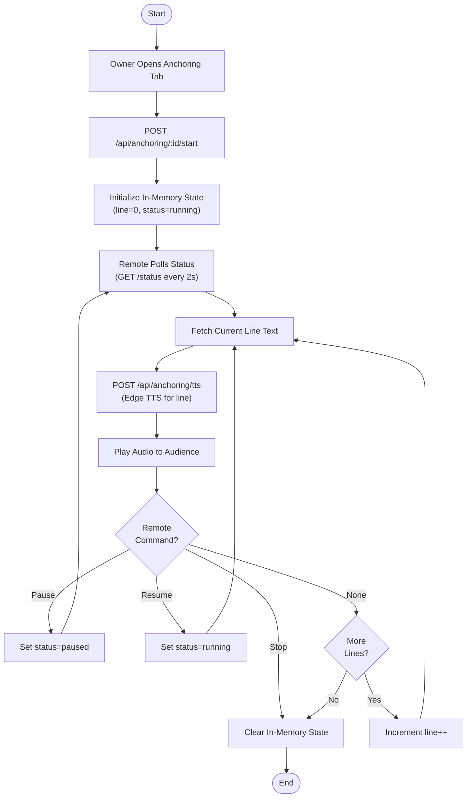
```mermaid
flowchart TD
    Start([Start]) --> A["Owner Opens Anchoring Tab"]
    A --> B["POST /api/anchoring/:id/start"]
    B --> C["Initialize In-Memory State\n(line=0, status=running)"]
    C --> D["Remote Polls Status\n(GET /status every 2s)"]
    D --> E["Fetch Current Line Text"]
    E --> F["POST /api/anchoring/tts\n(Edge TTS for line)"]
    F --> G["Play Audio to Audience"]
    G --> H{"Remote\nCommand?"}
    H -->|Pause| I["Set status=paused"] --> D
    H -->|Resume| J["Set status=running"] --> E
    H -->|Stop| K["Clear In-Memory State"] --> End([End])
    H -->|None| L{"More\nLines?"}
    L -->|Yes| M["Increment line++"] --> E
    L -->|No| K
```

---

## 9. Sequence Diagrams

### 9.1 User Login Sequence

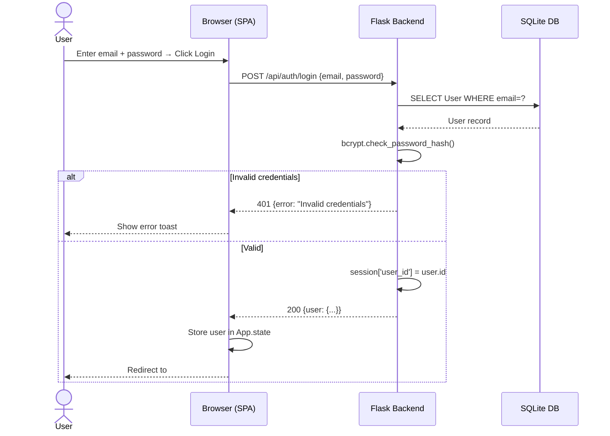
```mermaid
sequenceDiagram
    actor User
    participant Browser as Browser (SPA)
    participant Flask as Flask Backend
    participant DB as SQLite DB

    User->>Browser: Enter email + password → Click Login
    Browser->>Flask: POST /api/auth/login {email, password}
    Flask->>DB: SELECT User WHERE email=?
    DB-->>Flask: User record
    Flask->>Flask: bcrypt.check_password_hash()
    alt Invalid credentials
        Flask-->>Browser: 401 {error: "Invalid credentials"}
        Browser-->>User: Show error toast
    else Valid
        Flask->>Flask: session['user_id'] = user.id
        Flask-->>Browser: 200 {user: {...}}
        Browser->>Browser: Store user in App.state
        Browser-->>User: Redirect to #/dashboard
    end
```

### 9.2 Text Chat Message Sequence

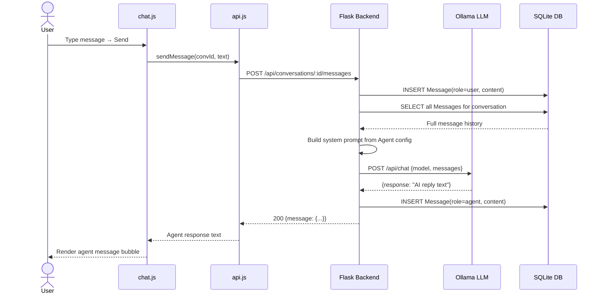
```mermaid
sequenceDiagram
    actor User
    participant Chat as chat.js
    participant API as api.js
    participant Flask as Flask Backend
    participant Ollama as Ollama LLM
    participant DB as SQLite DB

    User->>Chat: Type message → Send
    Chat->>API: sendMessage(convId, text)
    API->>Flask: POST /api/conversations/:id/messages
    Flask->>DB: INSERT Message(role=user, content)
    Flask->>DB: SELECT all Messages for conversation
    DB-->>Flask: Full message history
    Flask->>Flask: Build system prompt from Agent config
    Flask->>Ollama: POST /api/chat {model, messages}
    Ollama-->>Flask: {response: "AI reply text"}
    Flask->>DB: INSERT Message(role=agent, content)
    Flask-->>API: 200 {message: {...}}
    API-->>Chat: Agent response text
    Chat-->>User: Render agent message bubble
```

### 9.3 Video Call with Interrupt Sequence

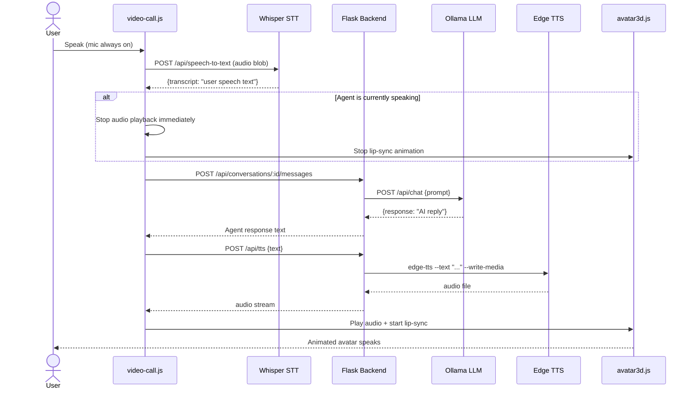
```mermaid
sequenceDiagram
    actor User
    participant VC as video-call.js
    participant STT as Whisper STT
    participant Flask as Flask Backend
    participant Ollama as Ollama LLM
    participant TTS as Edge TTS
    participant Avatar as avatar3d.js

    User->>VC: Speak (mic always on)
    VC->>STT: POST /api/speech-to-text (audio blob)
    STT-->>VC: {transcript: "user speech text"}

    alt Agent is currently speaking
        VC->>VC: Stop audio playback immediately
        VC->>Avatar: Stop lip-sync animation
    end

    VC->>Flask: POST /api/conversations/:id/messages
    Flask->>Ollama: POST /api/chat {prompt}
    Ollama-->>Flask: {response: "AI reply"}
    Flask-->>VC: Agent response text
    VC->>Flask: POST /api/tts {text}
    Flask->>TTS: edge-tts --text "..." --write-media
    TTS-->>Flask: audio file
    Flask-->>VC: audio stream
    VC->>Avatar: Play audio + start lip-sync
    Avatar-->>User: Animated avatar speaks
```

### 9.4 Share Link — Guest Chat Sequence

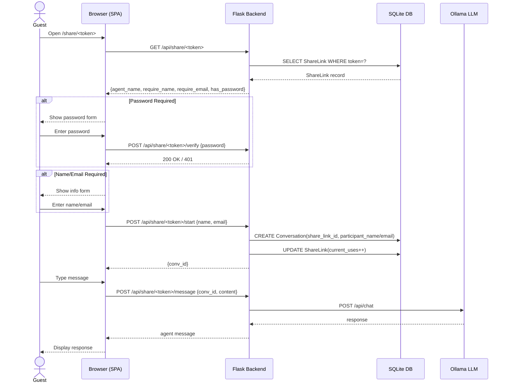
```mermaid
sequenceDiagram
    actor Guest
    participant Browser as Browser (SPA)
    participant Flask as Flask Backend
    participant DB as SQLite DB
    participant Ollama as Ollama LLM

    Guest->>Browser: Open /share/<token>
    Browser->>Flask: GET /api/share/<token>
    Flask->>DB: SELECT ShareLink WHERE token=?
    DB-->>Flask: ShareLink record
    Flask-->>Browser: {agent_name, require_name, require_email, has_password}

    alt Password Required
        Browser-->>Guest: Show password form
        Guest->>Browser: Enter password
        Browser->>Flask: POST /api/share/<token>/verify {password}
        Flask-->>Browser: 200 OK / 401
    end

    alt Name/Email Required
        Browser-->>Guest: Show info form
        Guest->>Browser: Enter name/email
    end

    Browser->>Flask: POST /api/share/<token>/start {name, email}
    Flask->>DB: CREATE Conversation(share_link_id, participant_name/email)
    Flask->>DB: UPDATE ShareLink(current_uses++)
    Flask-->>Browser: {conv_id}

    Guest->>Browser: Type message
    Browser->>Flask: POST /api/share/<token>/message {conv_id, content}
    Flask->>Ollama: POST /api/chat
    Ollama-->>Flask: response
    Flask-->>Browser: agent message
    Browser-->>Guest: Display response
```

### 9.5 Report Generation Sequence

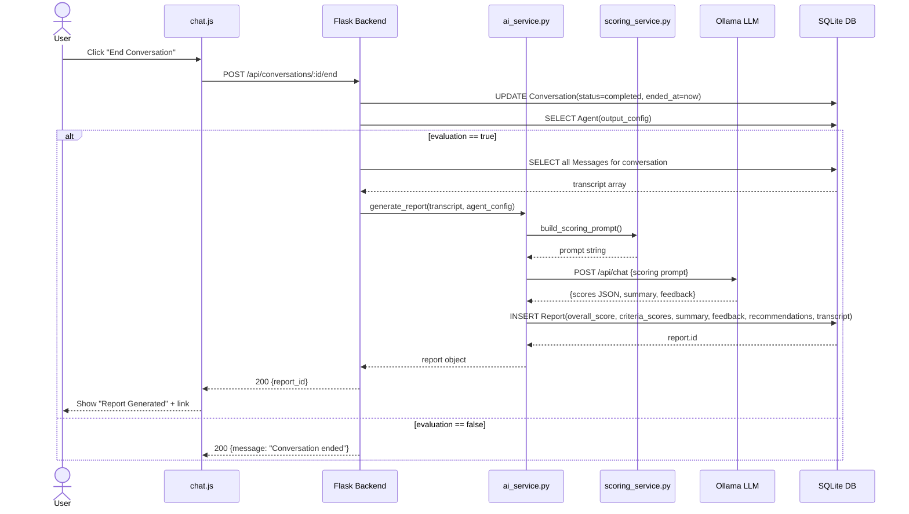
```mermaid
sequenceDiagram
    actor User
    participant Chat as chat.js
    participant Flask as Flask Backend
    participant AI as ai_service.py
    participant Scoring as scoring_service.py
    participant Ollama as Ollama LLM
    participant DB as SQLite DB

    User->>Chat: Click "End Conversation"
    Chat->>Flask: POST /api/conversations/:id/end
    Flask->>DB: UPDATE Conversation(status=completed, ended_at=now)
    Flask->>DB: SELECT Agent(output_config)

    alt evaluation == true
        Flask->>DB: SELECT all Messages for conversation
        DB-->>Flask: transcript array
        Flask->>AI: generate_report(transcript, agent_config)
        AI->>Scoring: build_scoring_prompt()
        Scoring-->>AI: prompt string
        AI->>Ollama: POST /api/chat {scoring prompt}
        Ollama-->>AI: {scores JSON, summary, feedback}
        AI->>DB: INSERT Report(overall_score, criteria_scores, summary, feedback, recommendations, transcript)
        DB-->>AI: report.id
        AI-->>Flask: report object
        Flask-->>Chat: 200 {report_id}
        Chat-->>User: Show "Report Generated" + link
    else evaluation == false
        Flask-->>Chat: 200 {message: "Conversation ended"}
    end
```

---

## 10. Entity-Relationship Diagram

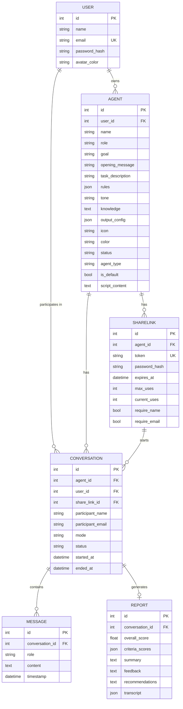
```mermaid
erDiagram
    USER {
        int id PK
        string name
        string email UK
        string password_hash
        string avatar_color
    }

    AGENT {
        int id PK
        int user_id FK
        string name
        string role
        string goal
        string opening_message
        string task_description
        json rules
        string tone
        text knowledge
        json output_config
        string icon
        string color
        string status
        string agent_type
        bool is_default
        text script_content
    }

    CONVERSATION {
        int id PK
        int agent_id FK
        int user_id FK
        int share_link_id FK
        string participant_name
        string participant_email
        string mode
        string status
        datetime started_at
        datetime ended_at
    }

    MESSAGE {
        int id PK
        int conversation_id FK
        string role
        text content
        datetime timestamp
    }

    SHARELINK {
        int id PK
        int agent_id FK
        string token UK
        string password_hash
        datetime expires_at
        int max_uses
        int current_uses
        bool require_name
        bool require_email
    }

    REPORT {
        int id PK
        int conversation_id FK
        float overall_score
        json criteria_scores
        text summary
        text feedback
        text recommendations
        json transcript
    }

    USER ||--o{ AGENT : "owns"
    USER ||--o{ CONVERSATION : "participates in"
    AGENT ||--o{ CONVERSATION : "has"
    AGENT ||--o{ SHARELINK : "has"
    CONVERSATION ||--o{ MESSAGE : "contains"
    CONVERSATION ||--o| REPORT : "generates"
    SHARELINK ||--o{ CONVERSATION : "starts"
```

---

## 11. State Diagrams

### 11.1 Conversation State Machine

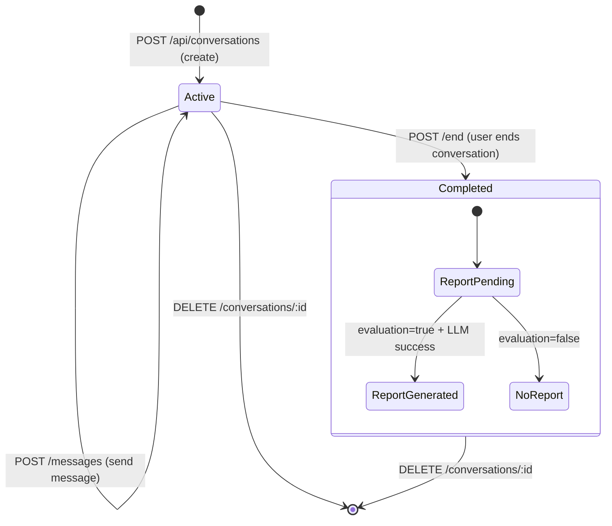
```mermaid
stateDiagram-v2
    [*] --> Active : POST /api/conversations (create)
    Active --> Active : POST /messages (send message)
    Active --> Completed : POST /end (user ends conversation)
    Completed --> [*] : DELETE /conversations/:id
    Active --> [*] : DELETE /conversations/:id

    state Completed {
        [*] --> ReportPending
        ReportPending --> ReportGenerated : evaluation=true + LLM success
        ReportPending --> NoReport : evaluation=false
    }
```

### 11.2 Share Link State Machine

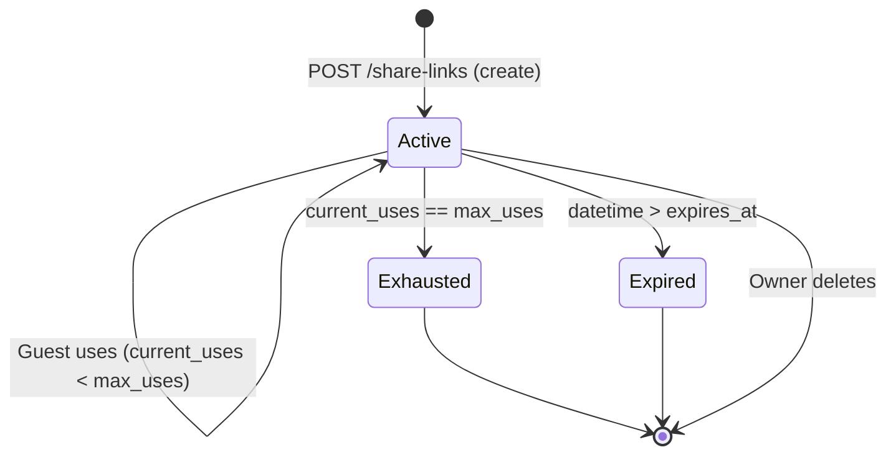
```mermaid
stateDiagram-v2
    [*] --> Active : POST /share-links (create)
    Active --> Active : Guest uses (current_uses < max_uses)
    Active --> Exhausted : current_uses == max_uses
    Active --> Expired : datetime > expires_at
    Exhausted --> [*]
    Expired --> [*]
    Active --> [*] : Owner deletes
```

### 11.3 Anchoring Session State Machine

```mermaid
stateDiagram-v2
    [*] --> Running : POST /anchoring/:id/start
    Running --> Paused : POST /control {action: pause}
    Paused --> Running : POST /control {action: resume}
    Running --> Stopped : POST /control {action: stop}
    Running --> Stopped : Last line read
    Paused --> Stopped : POST /control {action: stop}
    Stopped --> [*] : In-memory state cleared
```

---

## 12. Class Diagram

```mermaid
classDiagram
    class User {
        +int id
        +string name
        +string email
        +string password_hash
        +string avatar_color
        +set_password(password)
        +check_password(password) bool
    }

    class Agent {
        +int id
        +int user_id
        +string name
        +string role
        +string goal
        +string opening_message
        +string task_description
        +list rules
        +string tone
        +string knowledge
        +dict output_config
        +string icon
        +string color
        +string status
        +string agent_type
        +bool is_default
        +string script_content
        +to_dict() dict
    }

    class Conversation {
        +int id
        +int agent_id
        +int user_id
        +int share_link_id
        +string participant_name
        +string participant_email
        +string mode
        +string status
        +datetime started_at
        +datetime ended_at
        +to_dict() dict
    }

    class Message {
        +int id
        +int conversation_id
        +string role
        +string content
        +datetime timestamp
        +to_dict() dict
    }

    class ShareLink {
        +int id
        +int agent_id
        +string token
        +string password_hash
        +datetime expires_at
        +int max_uses
        +int current_uses
        +bool require_name
        +bool require_email
        +is_valid() bool
        +set_password(password)
        +check_password(password) bool
    }

    class Report {
        +int id
        +int conversation_id
        +float overall_score
        +dict criteria_scores
        +string summary
        +string feedback
        +string recommendations
        +list transcript
        +to_dict() dict
    }

    class AIService {
        +chat(agent, history) string
        +generate_report(transcript, agent) dict
        +report_chat(agent_id, question, history) string
    }

    class ScoringService {
        +build_scoring_prompt(transcript, agent) string
        +parse_scores(llm_response) dict
    }

    User "1" --> "0..*" Agent : owns
    User "1" --> "0..*" Conversation : participates
    Agent "1" --> "0..*" Conversation : has
    Agent "1" --> "0..*" ShareLink : has
    Conversation "1" --> "0..*" Message : contains
    Conversation "1" --> "0..1" Report : generates
    ShareLink "0..*" --> "0..*" Conversation : initiates
    AIService --> Agent : uses config
    ScoringService --> Report : generates
```

---

## 13. API Specification

### 13.1 Authentication Endpoints

| Method | Endpoint | Auth | Request Body | Response | Description |
|--------|----------|------|-------------|----------|-------------|
| POST | `/api/auth/signup` | ❌ | `{name, email, password}` | `{user}` | Register new user |
| POST | `/api/auth/login` | ❌ | `{email, password}` | `{user}` | Login, create session |
| POST | `/api/auth/logout` | ✅ | — | `{message}` | Destroy session |
| GET | `/api/auth/me` | ✅ | — | `{user}` | Get current user |

### 13.2 Agent Endpoints

| Method | Endpoint | Auth | Description |
|--------|----------|------|-------------|
| GET | `/api/agents` | ✅ | List user's agents |
| POST | `/api/agents` | ✅ | Create new agent |
| GET | `/api/agents/<id>` | ✅ | Get agent details |
| PUT | `/api/agents/<id>` | ✅ | Update agent |
| DELETE | `/api/agents/<id>` | ✅ | Delete agent |
| GET | `/api/agents/<id>/share-links` | ✅ | List share links for agent |
| POST | `/api/agents/<id>/share-links` | ✅ | Create share link |
| POST | `/api/agents/<id>/report-chat` | ✅ | AI chat with report context |
| POST | `/api/agents/<id>/export-report` | ✅ | Export report as DOCX |

### 13.3 Conversation Endpoints

| Method | Endpoint | Auth | Description |
|--------|----------|------|-------------|
| GET | `/api/conversations` | ✅ | List all conversations |
| POST | `/api/conversations` | ✅ | Create conversation |
| GET | `/api/conversations/<id>` | ✅ | Get conversation + messages |
| DELETE | `/api/conversations/<id>` | ✅ | Delete conversation |
| POST | `/api/conversations/<id>/messages` | ✅ | Send message |
| POST | `/api/conversations/<id>/end` | ✅ | End + generate report |

### 13.4 Report Endpoints

| Method | Endpoint | Auth | Description |
|--------|----------|------|-------------|
| GET | `/api/reports` | ✅ | List all reports |
| GET | `/api/reports/<id>` | ✅ | Get single report |
| POST | `/api/reports/generate/<conv_id>` | ✅ | Manually generate report |

### 13.5 Public Share Endpoints

| Method | Endpoint | Auth | Description |
|--------|----------|------|-------------|
| GET | `/api/share/<token>` | ❌ | Get share link info |
| POST | `/api/share/<token>/verify` | ❌ | Verify share link password |
| POST | `/api/share/<token>/start` | ❌ | Start guest conversation |
| POST | `/api/share/<token>/message` | ❌ | Send message as guest |

### 13.6 Anchoring Endpoints

| Method | Endpoint | Auth | Description |
|--------|----------|------|-------------|
| POST | `/api/anchoring/<agent_id>/start` | ✅ | Start anchoring session |
| POST | `/api/anchoring/<agent_id>/control` | ✅ | Pause / Resume / Stop |
| GET | `/api/anchoring/<agent_id>/status` | ✅ | Get current line & status |
| POST | `/api/anchoring/tts` | ✅ | TTS for a script line |

### 13.7 Utility Endpoints

| Method | Endpoint | Auth | Description |
|--------|----------|------|-------------|
| POST | `/api/upload` | ✅ | Upload image file |
| POST | `/api/speech-to-text` | ✅ | Convert audio to text (Whisper) |
| POST | `/api/tts` | ✅ | Convert text to audio (Edge TTS) |

---

## 14. UI/UX Requirements

### 14.1 SPA Navigation

| Req ID | Requirement |
|--------|-------------|
| UI-01 | All navigation shall use hash-based routing (`#/route`) with zero page reloads |
| UI-02 | `router.js` shall intercept all `hashchange` events and render the correct page module |
| UI-03 | Unauthenticated access to protected routes shall redirect to `#/login` |
| UI-04 | The active sidebar item shall be highlighted based on the current route |

### 14.2 SPA Route Table

| Hash Route | JS File | Description |
|------------|---------|-------------|
| `#/login` | login.js | Login form |
| `#/signup` | signup.js | Signup form |
| `#/dashboard` | dashboard.js | Stats + recent activity |
| `#/agents` | agents.js | Agent list, search, filter |
| `#/agents/new` | agent-wizard.js | 4-step creation wizard |
| `#/agents/:id` | agent-detail.js | Tabbed agent detail |
| `#/chat/:convId` | chat.js | Text chat UI |
| `#/video-call/:convId` | video-call.js | 3D avatar video call |
| `#/conversations` | conversations.js | All conversations history |
| `#/reports` | reports.js | Reports history card list |
| `#/templates` | templates.js | Template gallery |
| `#/share/:token` | share-access.js | Public guest chat |
| `#/anchoring/:id` | anchoring.js | Teleprompter local view |
| `#/anchoring-remote/:id` | anchoring-remote.js | Remote control view |

### 14.3 Theme & Styling

| Req ID | Requirement |
|--------|-------------|
| UI-05 | Dark mode shall be toggled and persisted in `localStorage` as `personaflow-theme` |
| UI-06 | Dark mode shall be applied via `[data-theme=dark]` on `<html>` before body renders |
| UI-07 | Single stylesheet (`styles.css`, ~90KB) shall define all visual styles |
| UI-08 | Google Fonts (Inter) and Font Awesome 6.4 shall be used for typography and icons |

---

## 15. External Interface Requirements

### 15.1 Ollama LLM API

| Item | Detail |
|------|--------|
| Base URL | `http://localhost:11434` |
| Endpoint | `POST /api/chat` |
| Model | `jarvis-x` (configurable in `config.py`) |
| Payload | `{model, messages: [{role, content}], stream: false}` |
| Response | `{message: {content: "..."}}` |
| Error handling | Returns 503 to client if Ollama unreachable |

### 15.2 Microsoft Edge TTS

| Item | Detail |
|------|--------|
| Invocation | Python subprocess via `edge-tts` CLI |
| Input | Plain text string |
| Output | MP3/WAV audio file written to temp path |
| Voices | Configurable; default English voice |

### 15.3 OpenAI Whisper STT

| Item | Detail |
|------|--------|
| Invocation | Python `speech_recognition` library / Whisper model |
| Input | Audio blob (WebM/WAV) from browser |
| Output | Transcript text string |

### 15.4 Three.js 3D Avatar

| Item | Detail |
|------|--------|
| Library | Three.js (CDN or bundled) |
| Model format | GLTF / FBX via `three-converter.js` |
| Assets | Stored in `frontend/3d-assets/` |
| Lip-sync | Custom phoneme engine in `lipsync-engine.js` |
| Animations | Idle + morph-target based mouth shapes |

---

## 16. Constraints & Limitations

| Constraint | Detail |
|------------|--------|
| **Local Only** | Application runs at `localhost:5000`; no production deployment configured |
| **Ollama Dependency** | All AI features require Ollama running locally; no fallback AI provider |
| **SQLite** | Single-file database; not suitable for concurrent multi-user production workloads |
| **Browser Compatibility** | Full feature set requires Chrome/Edge (WebAudio, Web Speech API, WebGL) |
| **In-Memory Anchoring State** | Anchoring session state is not persisted to DB; server restart resets all sessions |
| **Session Security** | Flask sessions use a single `SECRET_KEY`; should be changed in any production use |
| **AI Model** | Default `jarvis-x` model must be pulled in Ollama; other models configurable in `config.py` |

---

## 17. Future Enhancements

| Priority | Enhancement |
|----------|------------|
| HIGH | Production deployment (PostgreSQL, Docker, HTTPS) |
| HIGH | Multi-user concurrency support |
| MEDIUM | OAuth2 / Social login (Google, GitHub) |
| MEDIUM | Persist Anchoring state to database |
| MEDIUM | Real-time WebSocket-based chat instead of REST polling |
| MEDIUM | Agent marketplace (discover and use community agents) |
| LOW | Mobile app (React Native / Flutter) |
| LOW | Multi-language TTS and STT support |
| LOW | Report comparison across multiple conversations |
| LOW | Team/organization accounts with role-based access |
| LOW | Plugin/extension system for custom agent capabilities |

---

## 18. Appendix

### 18.1 Glossary

| Term | Definition |
|------|-----------|
| **Agent** | A configured AI persona with specific role, personality, and rules |
| **Anchoring** | A feature mode where an agent reads a pre-written script via TTS as a teleprompter |
| **Conversation** | A single chat or video call session between a user/guest and an agent |
| **Lip-sync** | Synchronization of avatar mouth animation with spoken audio using phoneme mapping |
| **Ollama** | An open-source local LLM runtime supporting multiple language models |
| **Phoneme** | The smallest unit of sound in language, used to drive avatar mouth shapes |
| **Report** | An AI-generated evaluation of a completed conversation with scores and feedback |
| **Share Link** | A tokenized URL allowing guest access to chat with a specific agent |
| **SPA** | Single Page Application — all navigation happens client-side without page reloads |
| **TTS** | Text-to-Speech — converting written text to spoken audio |
| **STT** | Speech-to-Text — converting spoken audio to written text |
| **Transcript** | A JSON record of all messages in a conversation, stored within a Report |

### 18.2 Revision History

| Version | Date | Author | Changes |
|---------|------|--------|---------|
| 1.0 | 2026-03-10 | PersonaFlow Team | Initial SRS creation |

---

*End of Software Requirements Specification — PersonaFlow v1.0*
